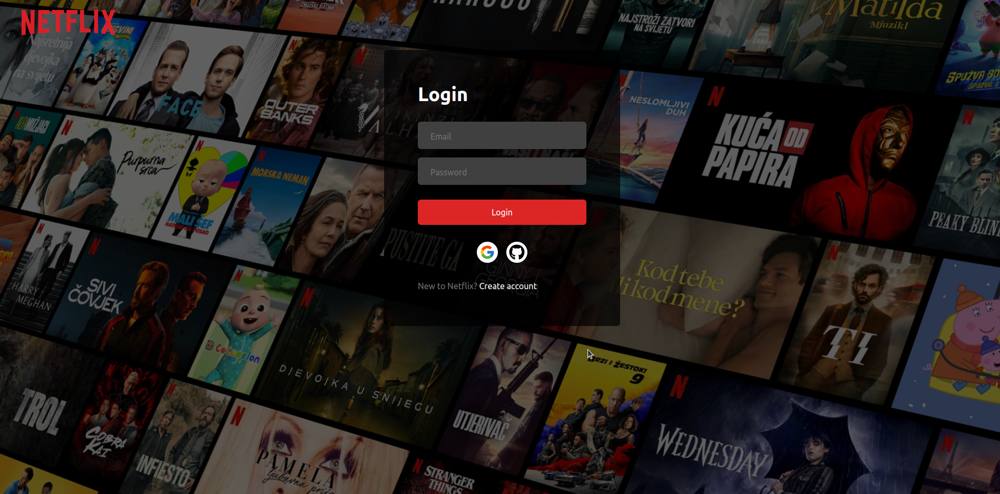

<h3 align="center">Clone of Netflix</h3>

Clone of Netflix made with Next.js, React, TailwindCSS

 

<h1 align="center">
<a href="https://netflix-clone-nextjs-omega.vercel.app/">Live Demo</a>
</h1>

# About

1. [ ] You can contact me at [belov.yanko@gmail.com](mailto:belov.yanko@gmail.com).
2. [ ] 
## Technologies Used

This project was built using the following technologies:

- **Next.js**
- **React.js**
- **TypeScript**
- **JavaScript**
- **Prisma**
- **MongoDB**
- **Node.js**
- **Tailwind**
- **ESLint**
- **Prettier**
